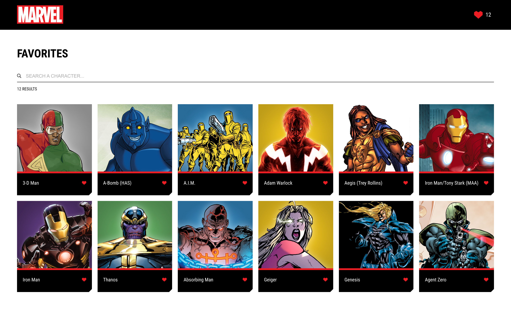
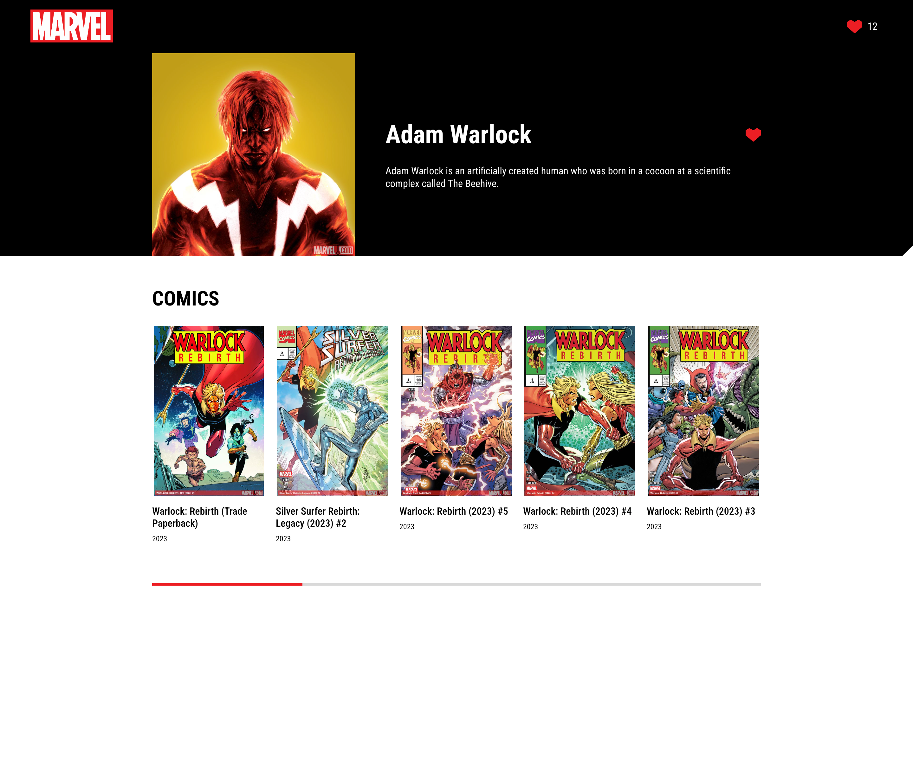

# ZARA WEB CHALLENGE

Application to view and search for Marvel characters for the Zara Front-end coding challenge by David Caro Gallego.

## Installation

The project has been developed with NodeJS v20.11.1

Use pnpm package manager to install the necessary dependencies.

```bash
pnpm install
```

## Scripts

Run the application in development mode

```bash
pnpm run dev
```

Generate a production build

```bash
pnpm run build
```

Locally preview the production build

```bash
pnpm run preview
```

## Coding challenge Requirements

The test consists of a web application to view and search for Marvel characters. The application should have three screens:

- **Main screen**: It must display the list of the first 50 Marvel characters, allow searching by name (managed by API) and add characters to favorites.
- **Favorites screen**: It must show the list of characters that the user has added to favorites and allow searching by name.
- **Character details screen**: It must show all the information about the character and the list of comics in which it appears and allow to add the character to favorites.

It must also have a header that allows navigating to the main screen and the favorites screen, as well as displaying a counter of the characters saved in favorites.<br/>
In addition, it is required to implement tests to check the correct behavior of the application, to have a responsive design and to have a correct accessibility.

## Dependencies

- [Vite](https://vitejs.dev) used to generate the initial structure of the project.
- [Vitest](https://vitest.dev) + [React Testing Library](https://testing-library.com/docs/react-testing-library/intro) to write and run the unit tests.
- [React Router](https://reactrouter.com) to manage the different routes of the application.
- [Tanstack Query](https://tanstack.com/query) + [Axios](https://axios-http.com) to make the necessary API calls, manage their state and store the information received in cache.
- [Fuse](https://fusejs.io) for fuzzy searching of characters by name in the favorites screen.

## Result

App is deployed at [https://davcaro-zara-web-challenge.netlify.app](https://davcaro-zara-web-challenge.netlify.app) 🎉




